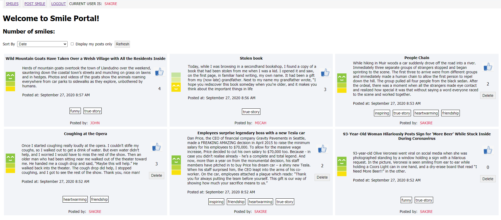
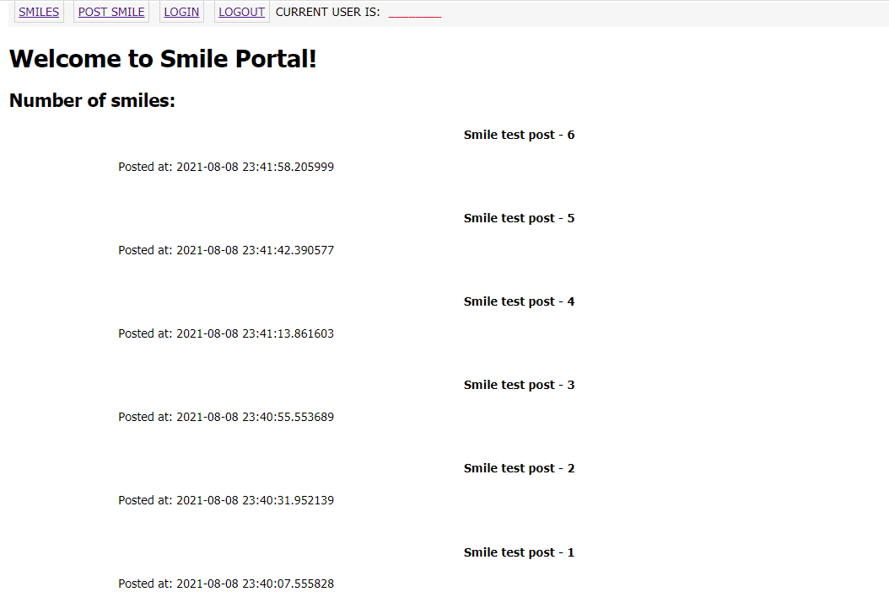
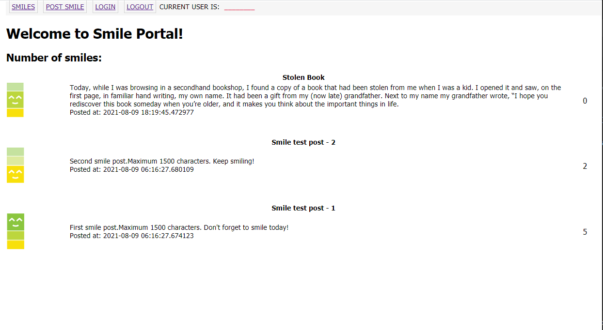
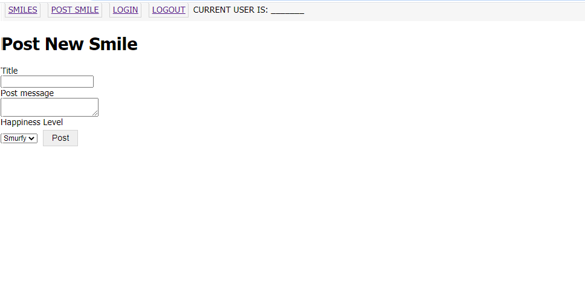
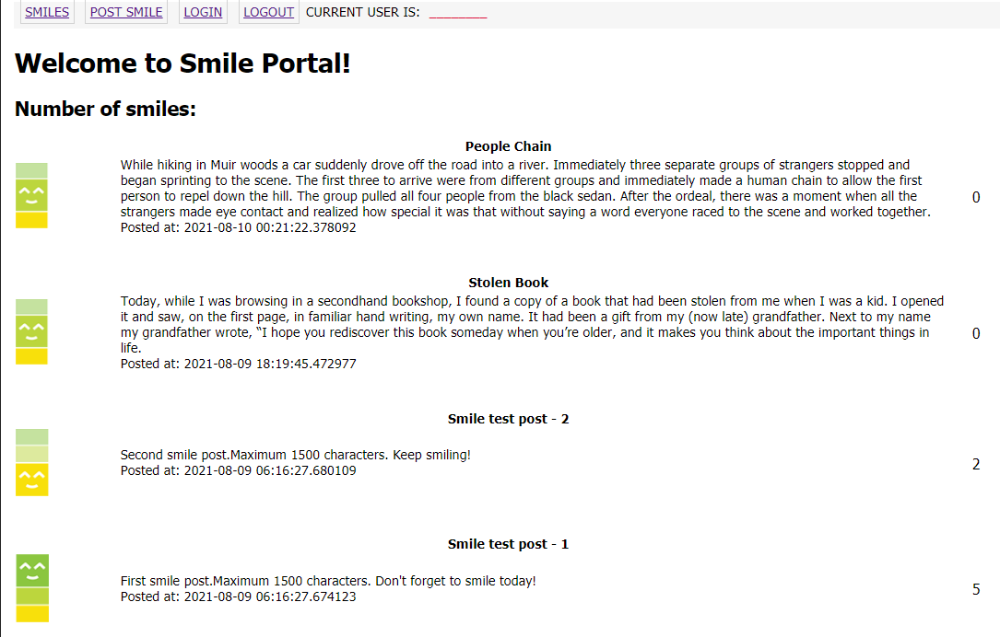
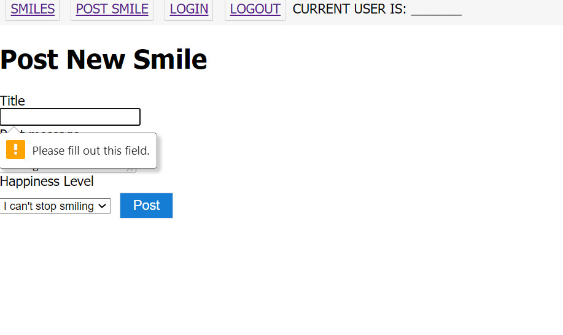
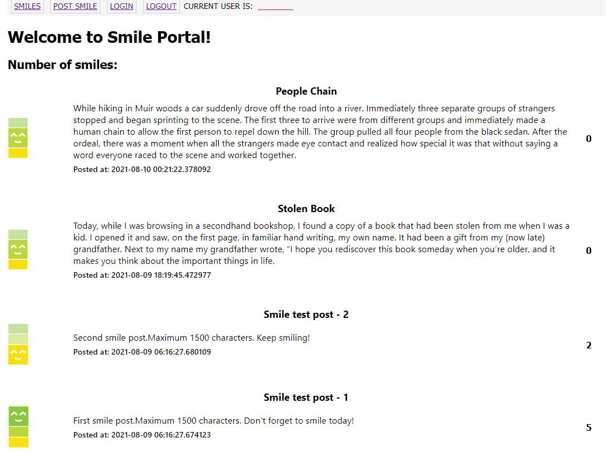
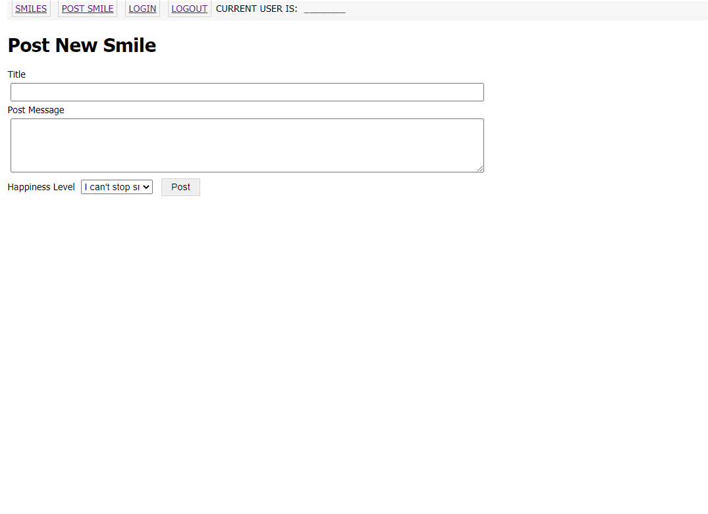
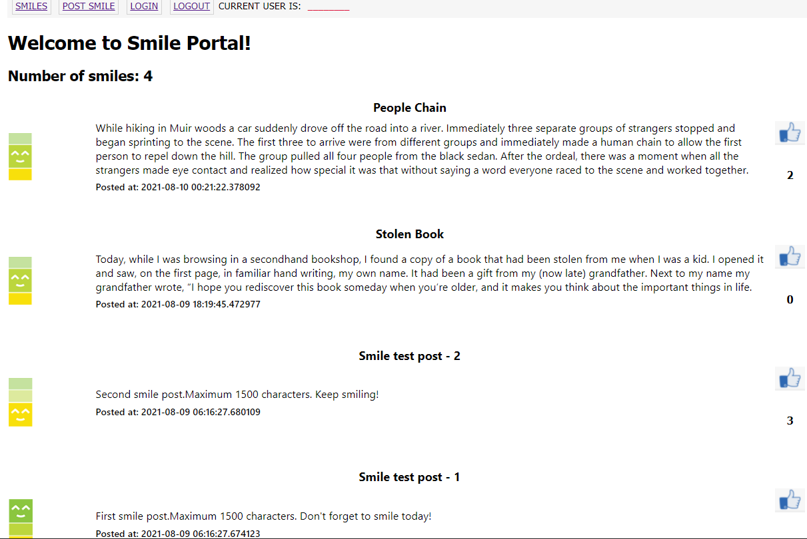

# Warmup Project - CptS322 - Fall 2021

Before we jump into the main team projects, we will practice  web
development by building a simple message portal called "Smile". 

Smile is an app to share experiences from your day that made you smile and things people did that you are grateful for. It's inspired by the Gratitude Journal. Psychologists did a series of research experiments where they had individuals write down three things they are grateful for each day, and it significantly boosted their happiness. But instead of keeping a super secret personal journal, why not spread the happiness? Users can read the "smile" messages others have posted, or post their own. 

The project development is split into three milestones. You'll be building out these features:

1. Milestone-1: Displaying all "smile" posts; creating new posts; liking posts 
2. Milestone-2: Associating tags with posts;  sorting the posts; making the layout responsive.
3. Milestone-3: Adding user signup, login, and logout; displaying user's own "smile" posts; deleting posts.  


This is how it is going to look at the end of milestone-1 of the project:

   <kbd>
    
   </kbd>

---
## Milestone-1: Displaying all "smile" posts; creating new posts; liking posts
---
In part 1, we will focus on the basic features of the app : displaying "smile" posts; creating new posts; liking posts. We will build both the frontend page templates and the backend routes for these features. We will also start building the database of the app.

---
### Task 0: Install Python
---
1. If you haven't yet, go ahead and install [Python](https://www.python.org/downloads/). (Your Python version should be 3.7.x or higher.)

      **Important** (Windows users):
      Please make sure to add the Python path to Windows Path. Read more [here](https://superuser.com/questions/143119/how-to-add-python-to-the-windows-path).
      Also, Windows installer now includes an option to add python.exe to the system search path. When you install Python, [select the "Add Python 3.x to PATH" option](https://www.google.com/url?sa=i&rct=j&q=&esrc=s&source=images&cd=&cad=rja&uact=8&ved=0ahUKEwit9NyWmafWAhXH44MKHaV9CfkQjRwIBw&url=https%3A%2F%2Floadbalancerblog.com%2Fblog%2F2015%2F11%2Fpython-35-install&psig=AFQjCNG10siDMl9gL49FY-3IQHICIPD2pw&ust=1505565091140981). If selected, the install directory will be added to your PATH.

      **Important** (Mac/Linux users): 
      Mac and Linux systems have Python 2.x installed already. When you type and run `python` on the terminal, it will run the Python2 interpreter. To launch Python 3, run `python3` and to run the `python3` installer run `pip3`.

2. If you have a Windows system I strongly suggest you to install a terminal emulator program to run the command line arguments. The following link provides a list of popular terminal programs for windows. [https://www.puttygen.com/windows-terminal-emulators](https://www.puttygen.com/windows-terminal-emulators)
   If you don't want to install a new program, you may use the Windows command prompt  `cmd` or VS Code terminal.  
   
---
### Task 1: Get Started with the Provided Files 
---
To help you start we have provided some boilerplate files that you will have to modify to implement the project.

Similar to the StudentApp exercise, you will commit your code to a repository under the CptS 322 GitHub classroom organization : `WSU-CptS322-Fall2021`  


1. Copy the below GitHub Assignment URL, and paste and open in a browser:

    [https://classroom.github.com/a/DUQKqO3q](https://classroom.github.com/a/DUQKqO3q)

    Accept the assignment and follow the steps. An assignment repository will be created for you under the  `WSU-CptS322-Fall2021` organization. GitHub will automatically commit the starter code provided to this repository.  This is your remote repo.
 
2. Create an empty project directory locally. Make sure this directory does not have another Git instance in its path. i.e. No parent directory and no child directory may also have a git instance.
   * Create the directory and go into that directory:   
    ```
        mkdir smileApp_<yourGitHubusername>
        cd smileApp_<yourGitHubusername>
    ```
    ( *REMOVE enclosing angle brackets , i.e., <>* ).

   * Initialize git in your project directory with the command 
  
    ```
        git init
    ```

   * Add your remote repo as the remote origin using the following command. Get your specific url from your repo by clicking the “clone” button. 
  
    ```
        git remote add origin  https://<your-repo>.git 
    ```

3. Pull starter code in your remote repo by using the command :
   
    ```
        git pull origin main
    ```

    If you get a "*repository not found*" or "*you are not authorized*" error, then there might be an issue with your GitHub credentials saved in your system. Refer to the [Canvas post for instructions on how to remove and re-enter GitHub credentials](https://wsu.instructure.com/courses/1486805/discussion_topics/6555774) for a possible solution. 

4. Rename the `master` branch to `main` by running the following command:
   
    ```
        git branch -m main
    ```

   Make sure the rename was succesful by running the command  `git branch`.  The branch name should be `main`.  

5. Create a `README.md` file and type your name and major in this file. You may create and edit this file using a file editor or IDE (e.g. VS Code). 
   
6. Add and commit the changes in your repository.  Then push the commit to the `main` branch of your remote repo. 
   
    ```
        git add README.md 
        git commit -am "Added readme file." README.md
        git push origin main
    ```

7. Create a new branch called `milestone1` in your repository by executing the following command. Git will automatically copy all code from main branch to milestone1. 
   
    ```
        git branch milestone1
    ```
    
    Checkout to `milestone1` branch.
    ```
        git checkout milestone1
    ```

8. You will find the following provided files in the given started code:

```bash
    * app
            * __init__.py            Python script that initializes the `app` module. 
            * Controller
                * __init__.py            Python script that initializes the `Controller` module. 
                * auth_forms.py          Flask-WTF forms for authentication use cases, i.e., "registering a new user" and "login". 
                * forms.py               Flask-WTF forms for "creating a post" and "sorting all posts". 
                * errors.py              Error handlers for 404 and 505 errors
                * auth_routes.py         Routes handling authetication, i.e., "registering a new user" and "login". 
                * routes.py              Other routes
            * Model
                * __init__.py            Python script that initializes the `Model` module. 
                * models.py              Database models
            * View
                * static
                    * css
                        * main.css
                    * img 
                        * happiness-level-1.png  image for happiness-level-1
                        * happiness-level-2.png  image for happiness-level-1
                        * happiness-level-3.png  image for happiness-level-1
                        * like.png, like_hover.png      icons for like button
                * templates
                    * 404error.html      HTML template page for displaying 404 errors
                    * 500error.html      HTML template page for displaying 500 errors
                    * _post.html         HTML sub-template for displaying a smile post
                    * base.html          Base “skeleton” template that contains all the common elements of HTML pages.  
                    * create.html        HTML template for create post page
                    * index.html         HTML template for the main page 
                    * login.html         HTML template for the login page 
                    * register.html      HTML template for the user sign-up page 
    * tests
            * __init__.py            Python script that initializes the `tests` module. 
            * test_models.py         Tests for the `model` ; uses `unittest` framework
            * test_routes.py         Tests for the rotes ; uses `pytest` framework 
    * requirements.txt             Lists all the dependencies (required packages), along with their versions.
    * .flaskenv                    
    * config.py                    Python script that defines app's configuration variables 
    * smile.py                     Main application file
```

9. Install all the required packages. 
   The file `requirements.txt` lists all the required Python packages we will need for our application. You can install all packages at once by running the following command. 
    ```
        $ pip install -r requirements.txt
    ```
    *Note for Windows users*: If `pip` is not installed in your system, you need to also add the Python\Scripts path to the Windows Path. On Windows, Python will typically be installed under the directory `C:\Users\<username>\AppData\Local\Programs\Python\Python3.x`. Locate your Python installation directory, make sure `pip` or `pip3` is under the `Scripts` directory, and add the "path of Scripts directory" to the Path environment variable. 

    As we need these packages in our application, I will include the commands for installing them. If you already installed all packages in `requirements.txt`, you can skip those.  
   
    Initially, make sure that `flask` and `flask-sqlalchemy` are installed in the current virtual environment. If not, install those by running the following commands. 
 
    ```
        pip install flask
        pip install flask-sqlalchemy
    ```

    ** Note: ** Optionally, you can install the required packages in a virtual environment so that the system-wide Python interpreter is not affected. Refer to  the following link for details. [https://blog.miguelgrinberg.com/post/the-flask-mega-tutorial-part-i-hello-world](https://blog.miguelgrinberg.com/post/the-flask-mega-tutorial-part-i-hello-world).

    If you use a virtual environment, make sure to activate virtual environment before you install the requirements. 

10. The file named `.flaskenv` located in the top-level directory of the starter code defines the `FLASK_APP` and `FLASK_DEBUG` environment variables. The `FLASK_APP` environment variable is assigned to the main application file `smile.py`. In order to import these variables automatically when we run flask, we need to install the `python-dotenv` package by running the following command:
    ```
       pip install python-dotenv
    ```

11.  How to run the app:

* First run the backend:
  ```
    python smile.py
  ```

    Note:  Smile App starter code uses a "factory method" (i.e., `create_app()`) to create the flask application in `smile.py`. This is similar to the Student App structure in v.14. 
    In the `.flaskenv` file, we set the `FLASK_APP` environment variable `smile.py` to specify how flask should load the application. However, if Flask can't read the this file correctly, it will try to access the database before it is initialized for the app and it will give the following error: "sqlalchemy.exc.OperationalError". So, when the `student.db` file is created for first time, make sure that you launch your application using the command 
    ` python smile.py`.
    Alternatively, you can use the following command:

    On Windows:  `set FLASK_DEBUG=1 && set FLASK_APP=smile.py && python -m flask run`
        
    On Mac:  `export FLASK_DEBUG=1 && export FLASK_APP=smile.py && python -m flask run`

* Open a browser (Chrome is recommended) and open the URL 'http://localhost:5000/'
    At this point, the page should look like the following. 
   
   <kbd>
    
   </kbd>
 
 **The provided code already implements the following:**

* initializes the app; configures the app for SQL-Alchemy database connection (see `smile.py` and `app\__init__.py`)
* defines a preliminary DB model that includes a table for certain fields of the post messages. (see '`app\Model\models.py`)
* creates the (SQlite) database file (see `initDB` function in `smile.py`)
* creates a preliminary Flask-WTF form for reading the post data.   

In milestone-1, you will have to make changes to the following files:

 * `main.css` 
 * `_post.html`
 * `base.html`
 * `index.html`
 * `create.html`
 * `forms.py`              
 * `models.py`              
 * `routes.py`


You will now be editing locally and complete the `milestone1` tasks. **Remember to commit frequently**.


---
### Task 2: Display "Smile" Posts
---
The first page you'll build is the home page. This page will show all smiles posted by everyone.

1. First, we need to update the database model for "posts" and add the missing fields. 

    In milestone-1, the schema for the "Post" model should include the following attributes. In milestones-2 and -3, we will add couple other fields to the Post schema as we add more features to our app (this is a suggestion, although other schemas may work just as well):

    **Add the missing fields to the "Post" model.** 

    |    |  Field name    | Description |  Field type  |  Constraints | Comments  
    |:---|:----:          |:----:       | :-----:      |  :-----:     | :-----:
    | 1. |  id            | auto generated id | integer | primary key  | (already included)
    | 2. |  title         | post title        |  string | max 150 chars   | (already included)
    | 3. |  body          | smile message     |  string | max 1500 chars   | 
    | 4. |  timestamp     | time the smile post was created| DateTime | default value is set to the UTC time when the post is created | (already included) 
    | 5. |  likes         | number of likes for the smile port | integer| default is set to 0 |
    | 6. |  happiness_level | the happiness level associated with the smile post | integer| default is set to 3 | (already included)


   **Important note:**  In order to re-create the database with the new schema, you need to first delete the current database file `smile.db` and re-run the backend app. The `initDB` function in `smile.py` will re-create the database file before the first request to the app. 
   Alternatively, you may migrate the database to the modified structure using `flask-migrate`. Check the Flask tutorial "Databases" post for more information. <a href = "https://blog.miguelgrinberg.com/post/the-flask-mega-tutorial-part-iv-database">https://blog.miguelgrinberg.com/post/the-flask-mega-tutorial-part-iv-database</a>

   After the database is re-created, no smile posts will be displayed on the main page. You need to manually insert couple posts on the Python prompt. 

   For example:

   ``` python
   > python
   >>> from app import create_app, db
   >>> app = create_app()
   >>> app.app_context().push()
   >>> db.create_all()
   >>> from app.Model.models import Post
   >>> p = Post(title="Smile test post - 1", body = "First smile post.Maximum 1500 characters. Don't forget to smile today!", likes=5, happiness_level = 3)
   >>> db.session.add(p)
   >>> p = Post(title="Smile test post - 2", body = "Second smile post.Maximum 1500 characters. Keep smiling!", likes=2, happiness_level = 1)
   >>> db.session.add(p)
   >>> db.session.commit()
   ```

   You can add several other smiles posts by repeating the last 3 commands above. 

2. In `app\View\templates\_post.html` add the remaining parts of a smile post to the HTML template. Look for the comments to find out where each item should be added to. 

    1. Add the "happiness level" image : There are 3 different happiness level images included under `app\View\static\img` and you should include the correct image according to the "happiness_level" value of the post, 
        i.e., happiness-level1 ->  `img//happiness-level-1.png`;  happiness-level2 ->  `img//happiness-level-2.png`, etc.<br> 
        You should use a nested "if-else" block to include the correct image.  
        For an example on how to add an image in Jinja2 HTML template, see the `like.png` image on line #18. The `width` of the happiness image should be `40px`. 

        Note that, you don't need the include the `href` attribute for happiness level image.  

    2. Add the post body.
    
    3. Add the like count of the post. 

  You can create new post messages by repeating the above command line commands. 
  When you open the main page on the browser (i.e., `http://localhost:5000/`), the page may look like the following. 

  <kbd>
    
  </kbd>

---
### Task 3: Create "Smile" Post
---

1. In `app\Controller\forms.py`, edit the `PostForm` and add an input field (`TextAreaField`) for the smile message "body". Add a data validator that will enforce that the smile post message is not empty (i.e., at least one character long), and it is at most 1500 characters long.  
Other form input fields for the title and happiness level inputs are already provided. Note that the form doesn't need to include a  "likes" field. A new Smile post will have "0" likes by default. 

    **Note**: Make sure to import `TextAreaField` from `wtforms`.  

2. In `app\View\templates\create.html`, edit the HTML template for smile post page and add the form items for smile message `body` and `happiness_level`. When the field validators for post `body` and `title` fail, an error message should be displayed. Make sure to display field validation error messages for title and body if the user enters invalid input. 

3. In `app\Controller\routes.py` add a new route to the `bp_routes` Blueprint for creating smile posts.   

    * URL : `/postsmile`
    * Methods: `GET` and `POST`

    The route decorator function should implement the following:

    - It should create an instance of `postForm` and pass the form instance to the `create.html` template for rendering. 
    - When the form is submitted, it should create a new `Post` item based on the form input and insert it to the database. 
    - It should issue a `flash()` message, that informs  the new smile post is created. You may include the post title or body in the message as well. 
    - Then, it should redirect to `routes.index` (check the class exercises for examples on how to redirect to a new page. )  

    **Note** :Please use the conditional  `if form.validate_on_submit()` to make sure that user input is valid when the form is submitted. 

4. In `base.html`, add a link to the "Post Smile" page in the navigation bar. Remember that `routes.postsmile` route renders the `create.html` page which displays the form for creating a smile post. There is already a placeholder "Post Smile" in `base.html`. You just need to add the URL for the `href` property.

5. On the main page, when you click at the "Post Smile" link in the navigation bar, the app should redirect to `routes.postsmile`. 

<kbd>
    
</kbd>

6. Fill out the form and create a smile messages. The app should redirect to index page and display the new smile post. 

<kbd>
    
</kbd>

7. When the post form is submitted, if no text is provided for title or body of the smile post, an error message should be displayed. 

    <kbd></kbd>

    Similarly, if the smile message post message exceeds 1500 characters, an error message should be displayed.  
    <kbd></kbd>


---
### Task 4: Stylin' It Pretty
---
It's coming along! Now let's style it nicer and make it look like an actual app. We only have the following styling guidelines as far as what we're
grading you on. You can any additional styling to make it look however you
think looks awesome.
For this task you will edit `/app/View/static/css/main.css` in addition to the HTML template pages.

1. Styling the `base.html` that displays the navigation bar and the flash message:

     * In the given skeleton code, `main.css` already defines the CSS style definitions for `\nav-container` which is applied to the navigation bar. 

     * To style the `flash` messages, define a CSS class selector called  `flash-container` class (in `main.css`) and use it to style the `</div>` element that encloses the flash message. You should specify appropriate background color, height, font style and size, padding, and margin for the flash messages. 

    **Important note:** Some browsers don't refresh the page correctly after changes are made to CSS styling. You need to clear the cash and refresh (press `Ctrl+Shift+R`) to see the changes. 

2. Styling the `_post.html` that displays the smile messages:
      *  The `posttitle` selector in `main.css` styles the title in a post message. Edit `posttitle` and specify appropriate font styling and padding. 
      *  In `main.css`, add a class selector called `postmessage` to style smile message body. Specify appropriate font styling and padding for the post body.  Apply `postmessage`  formatting to the <div> element enclosing the post body.  
      *  Add a class selector called `posttimestamp` to style the "*post timestamp*". Specify appropriate font styling and padding for the timetsamp. Apply `posttimestamp` to the `<div>` element enclosing the "*post timestamp*". 
      *  Add a class selector called `likecount` to style the "*like count*". The alignment should be centered and font should be bold. Apply `likecount` to the `<div>` element enclosing the "*like count*". 
    
    When you open the main page on the browser (i.e., `http://localhost:5000/`), the page may look like the following. You are welcome to style your page different than what is shown in the below image. As long as it is neat and organized, we will accept it.  

    <kbd></kbd>

3. Styling the `create.html` that displays the smile post form:

    * Add a class selector called `formtitle` to style title input box. Specify appropriate size (width), font styling, margins, and padding. Make sure to specify the width as percentage.  
        **Note:** The class argument is passed to form fields as input. See the  example for submit button in `create.html`. 
    * Add a class selector called `formbody` to style post body input box. Specify appropriate size (width, height), font styling, margins, and padding. Make sure to specify the width as percentage.  
    * Add a class selector called `formselect` to style happiness level selection box. Specify appropriate size (width, height), font styling, margins, and padding. Make sure to specify the width as percentage. 

    When you open the smile post page on the browser the page may look like the following. 

    <kbd></kbd>

---
### Task 5: Liking a Smile Post
---
1. When the like button for a smile post is clicked, the like count for that smile should be incremented by 1. To accomplish this we will add a new route to the  `bp_routes` Blueprint in `routes.py` with URL `/like/<post_id>` . 

    * URL : `/like/<post_id>`
    * Methods: `POST` 

    The view function of the route should implement the following:

    * Retrieve the post with id `post_id` from the database
    * Increment the post's like count by 1.
    * Write the updated post back to the database.
    * Re-direct to `routes.index` to reload the main page with the updated post. 

2. Now, in `_post.html`, add an HTML form element for submitting the `routes.like` post request. The template of the form is given below. Set the `action` of this form  (i.e., `###`) to the URL of the `routes.like` route. (Hint: use `url_for`) See the class exercise for examples on how to pass the route variable to `url_for`. Don't forget to pass the `post_id` attribute for the `like` route.
    ```html
    <form action="###" method="post">
    <input type="submit" value="" >
    </form>
    ```
    We will style the "like" button of a post using a background image (`like.png`). To achieve this, you need to style the `submit` button of the form using the CSS class selector `likebtn`. The CCS styling element for class `likebtn` is already defined in `main.css`.

    ##### <i>Note: For simplicity, here we issue the `routes.like` POST request in a basic HTML form element. You may alternatively create a simple wt-form element in the `index` route and render it here. (Similar to the `EmptyForm`  in the Student App  example). </i>
    <br>

Open the main page `http://localhost:5000/`, click at a like button, and make sure that the like count is incremented. 

---
### Task 6: Displaying the Number of Smiles
---
Lastly, we will update the main page and display the total number of smile posts at the top of the page. 

* In `index.html`, edit the  `<h2>` subtitle at the top of the page and include the number of post messages.

-------------------------------------------------------------------------------------

When you complete milestone-1, the index page may look like this. 

<kbd></kbd>


---
### How to Submit
---
1. Commit and push to GitHub

   * Add and commit your changes locally. Make sure you are in branch `milestone1`. 
       ```
       git checkout milestone1
       git add .
       git commit -m "Your own commit message"
       ```

   * Push the `milestone1` branch to your remote GitHub repo:
       ```
       git push origin milestone1
       ```
       - You can commit multiple times. Please make sure not to make any commits to `milestone1` branch after the milestone1 deadline. 
  


2. Submit your repo link on Canvas

   * Copy your repository URL and submit it in the Canvas `Milestone1` dropbox. 


