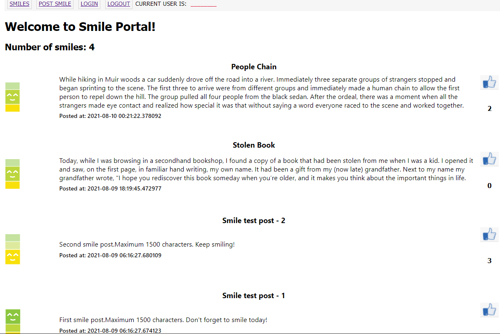

# Warmup Project - CptS322 - Fall 2021

# Milestone2

---

### Task 1: Get Started

---

In Milestone2,  you will start with your milestone-1 code and add additional features.

1. First, make sure that your are checked out to `milestone1` branch ; run the following comment if you are not already.

      ```
      git checkout milestone1
      ```

   Create and checkout to a new branch called "milestone2".  The following commands will create a new branch "milestone2" and checkout to that branch. 

      ```
      git branch milestone2
      git checkout milestone2
      ```

   Make sure that your 'milestone2' branch now has the latest milestone1 code. You will now be editing locally, and **remember to commit frequently**.

2. In milestone-2, you will have to make changes to the following files:

   * `main.css`
   * `_post.html`
   * `base.html`
   * `index.html`
   * `create.html`
   * `forms.py`
   * `models.py`
   * `routes.py`

7. How to run the app:
   * First run the backend (this will run the app in debug mode):

     `set FLASK_DEBUG=1 && python -m flask run`
   * Open a browser (Chrome is recommended) and open the URL 'http://localhost:5000/'
     At this point, the page should look like the following.

   <kbd></kbd>

---

### Task 2:  Responsive Layout for Desktop and Mobile

---

There are CSS frameworks like [Bootstrap](http://getbootstrap.com/css/#grid) and Foundation
which have grid layouts for developers to use just by adding pre-defined CSS column classes.
But in this project, we'll learn how to do responsive layouts manually and see how it works under the hood.

We will use CSS media queries to customize the display of the posts on the main page  ([see examples here](https://www.w3schools.com/css/css3_mediaqueries_ex.asp)). In the current version, the posts are displayed in a single column (i.e., one post per row). We will change our layout as follows:

* On screens that are more than 1200px wide, we will organize the posts in 3 columns;
* On screens that are more than 800px and less than 1200px wide, we will organize the posts in 2 columns;
* On screens that are less than 800px wide, we will go  from 2 columns to 1 column.

To accomplish this, we will do the following:

1. Style the container that displays all posts:

   * In `index.html`, enclose the `for` block that prints all the posts in a `<div>` container.
   * Add a class selector `postlist` in `main.css` to style this container. We will style the container as a flex box - it will dynaminally adjust the width of each box for different screeen sizes.  Set the `display` property to `flex` and `flex-wrap` property should be `wrap`.
2. Style the container that displays a single post:

   * In `index.html`, enclose the `include` block that prints a single post in a `<div>` container.
   * Add a class selector `post-box` in `main.css` to style this container. Set the `display` property to `flex` and `vertical-align` to `middle`. Also, set appropriate background-color, width, margin, and padding for the `post-box` container. Make sure to specify the with as a percentage value. 
  
3. In `main.css` add three CSS media queries  to customize the width of the `post-box` container.
   Make the width of the `post-box` container 32% when the screen size is larger than 1200px; make it 48% when the screen size is between 800px and 1200px, and 99% when the screen size is less than 800px. Note that margins are not part of the width and the remaning 2%-4% is used for margins between the boxes.

   Here is an example CSS media query that checks whether screen width is betweeb 800px and 1200px.

   ```css
   @media screen and (min-width: 800px) and (max-width:1200px){
     <-- include the styling for .post-box here-->
   }
   ```

   As the screen size changes, the width of the `post-box` containers will be adjusted with respect to the total screen size. And since the `postlist` container is flex box, the number of posts displayed in each row will be adjusted dynamically.

   You can test the responsive styling by dragging your desktop browser window larger or smaller than 800px and 1200px.

-------

4. Post a couple new stories in your app. 

  * When you open the main page on the browser (i.e., `http://localhost:5000/`), the page will look like the following when the screen width is greater than 1200px.

    <kbd>  </kbd>

  * When the screen width is greater than 1200px and less than 800px:

    <kbd>  </kbd>

  * When the screen width is less than than 800px:

    <kbd>  </kbd>

---

### Task 3: Revise DB Model - Add `Tag` table

---

In our Smile Portal app, the users will be able to associate some predefined tags with their stories. We will store those tags in the `Tag` table and define a "many-to-many" relationship  between `Post` and `Tag`. The relationship will store the associations between post messages and the tags associated with them. Note that a Post can have multiple tags associated with it and a tag can be assoicated with many posts.

   1. In `models.py`, add a database model called `Tag`. The 'Tag' table will store the tags for the posts. It should have the following attributes:


      |   | Field name | Description | Field type | Constraints | Comments |
      | :- | :-: | :-: | :-: | :-: | :-: |
      |  | id | auto generated id | integer | primary key | id of the Tag |
      |  | name | tag name | string | max 20 chars | for example: "funny","inspiring", etc. |


   **Important note:**  Remember that, in order to re-create the database with the new schema, you need to first delete the current database file `smile.db` and re-run the backend app. The decorator function `initDB` in `smile.py` will re-create the database file before the first request to the app.   Alternatively, you may migrate the database to the modified structure using `flask-migrate`.

   After the database is re-created, no smile posts will be displayed on the main page.

   2. In `models.py`, add a SQLAlchemy relationship table called `postTags` (use `db.Table` SQLAlchemy funtion to create this table - see the `enrolled` table we defined in StudentApp application for an example.). This table will store the associations between posts and the tags. Note that a post may be associated with multiple tags, and a tag can be associated to many posts. 

   **Important note:** In the file, `postTags` definition should be placed before both `Post` and `Tag` definitions. 

   `postTags` should have the following attributes:

      |   | Field name | Description | Field type | Constraints | Comments |
      | :- | :-: | :-: | :-: | :-: | :-: |
      |  | post_id | id of the post | integer | foreign key to `post.id` |   |
      |  | tag_id | the id of the tag | integer | foreign key to `tag.id` |   |


   Also, add a `__repr__` method to `Tag` model for printing tags. You should print the id and name of each tag.  See the `__repr__` methods in the class exercises.

   3. Next, add a relationship attribute called `tags` to the `Post` model. See the `Class.roster` and `Student.classes` relationship declerations in StudentApp class exercise for examples.

   The `tags` relationship should reference to the `Tag` table through `post_tags`. You should configure the other arguments of the  `tags` relationship as follows:

   ```python
    secondary = postTags
    primaryjoin=(postTags.c.post_id == id)
    backref=db.backref('postTags', lazy='dynamic')
    lazy='dynamic'
   ```
   4. Define a method called `get_tags` in the `Post` class that returns the tags for a post (i.e., returns `self.tags` relationship) . Remember that all methods of a class should have `self` as their first argument.

   5. Import `Tag` model and and `postTags`  table in `routes.py`.
   
   6. When the database is initialized, we would like to add some default tag names to the `Tag` table. 
      * In the given skeleton code, in `smile.py`, un-comment the lines 14-18 in  `initDB` decorator function. The Flask app will run this function before the first request and add the default tags to the database after the database is created. Make sure to import `Tag` table in `smile.py` file. 
      * Delete the `smile.db` database file,  re-run the backend app, and open main page on the browser (i.e., `http://localhost:5000/`). Make sure that `smile.db` file is re-generated. 

   7. We next will insert some posts to the `Post` table on the Python command line.  We will create the posts acording to the modified `Post` model.

      * First, we will make sure that the `Tag` table is initialized with the default tags. Execute the following on the Python command line:
   
        (If you have both versions of Python installed on your system, run the Python with `python3`. Make sure that you are in the main application directory on the the terminal window before you run Python. )

         ```python
         > python 
         >>> from app import create_app, db
         >>> app = create_app()
         >>> app.app_context().push()
         >>> from app.Model.models import Tag
         >>> allTags = Tag.query.all()
         >>> for t in allTags:
         >>>     print(t.name)
         ```

      * You should see the below tags printed.

         ```
         funny
         inspiring
         true-story
         heartwarming
         friendship
         ```
      * Now we will add some post data and associate them with tags.

         ```python
         >>> from app.Model.models import Post
         # Create a new post
         >>> p = Post(title="Test post-1", body = "First test smile post. Don't forget to smile today!", likes=0, happiness_level = 3)
         # Get the `tag` object with `name` "funny" 
         >>> t1 = Tag.query.filter_by(name="funny").first()
         # Append it to the `tags` relationship of the new post
         >>> p.tags.append(t1)
         # Get the `tag` object with `name` "heartwarming" 
         >>> t2 = Tag.query.filter_by(name="heartwarming").first()
         # Append it to the `tags` relationship of the new post
         >>> p.tags.append(t2)
         # Write the new post to the database
         >>> db.session.add(p)
         >>> db.session.commit()
         >>> 
         ```

         Note that, we first query the tag table to get some tags, then we associate them with the posts by calling the `append` function for the `tags` relationship, i.e., `p.tags.append()`.

      * Now we will retrieve and print the tags of a particular post.

         ```python
         >>> p1 = Post.query.filter_by(title = "Test post-1").first()
         >>> for t in p1.tags:
         >>>     print(t.name)
         ```
      * This should print the following.

         ```
         funny
         heartwarming
         ```

---

### Task 4: Associating tags with posts

---

In Task 3, we manually associated tags with posts. Now we will update the `PostForm` in `forms.py` and the `create.html` template and we will allow users choose some tags for their post when they create a new post. We will also update  `_post.html` and display the tags associated with each post.

   1. In `forms.py`, add a new field named `tag` to `PostForm` (before `submit`). This should be a `QuerySelectMultipleField` as shown below. The tag declaration is not complete; you need to define the lambda functions for `query_factory` and `get_label` fields.

      * `query_factory` should be assigned to a function that returns all tags in the `Tag` table.

      * `get_label` should be assigned to a function that takes a `Tag` object as argument and returns the name for that tag.

         ```python 
            tag =  QuerySelectMultipleField( 'Tag', query_factory=......... , get_label=........, widget=ListWidget(prefix_label=False), 
               option_widget=CheckboxInput() )
         ```
         See [https://wtforms-sqlalchemy.readthedocs.io/en/stable/wtforms_sqlalchemy/](https://wtforms-sqlalchemy.readthedocs.io/en/stable/wtforms_sqlalchemy/) for more information on `QuerySelectMultipleField`.

      * Make sure to import the following in `forms.py`:
        * `QuerySelectMultipleField` from `wtforms_sqlalchemy.fields`
        * `ListWidget` and `CheckboxInput` from `wtforms.widgets`
   
      * Also, make sure to import model `Tag` in `forms.py`. 

   2. In `create.html` add the "tag" form element to the form template. It should be after "happiness_level" select box and before "submit button.
    
   3. In `routes.py` revise the `routes.postsmile` route. Before the post is added to the database, append the selected tags to the `Post.tags` (similar to what we have done in Task 3 on the Python command).
   Note that, in the form instance, `form.tag.data` will hold the list of all selected tags (selected by user). You should iterate over each tag in `form.tag.data` and append them to `Post.tags`.

   4. When you open the "Post Smile" page on the browser (i.e., `http://localhost:5000/postsmile`), the page will look like the following:.

      <kbd>  </kbd>

   5. Run your app and **create a post by filling out the "create post form"**. Select multiple tags for your story.

      You can verify that tags are added correctly to your post by running the SQLAlchemy commands on the Python prompt, similar to what we did in Task 3. (In line-3 below, change the post id in `filter_by` to retrieve other posts.)

      ```python
      > python 
      >>> from app import create_app, db
      >>> app = create_app()
      >>> app.app_context().push()
      >>> from app.Model.models import Post, Tag
      >>> p1 = Post.query.filter_by(id = 2).first()
      >>> for t in p1.tags:
      >>>     print(t.name)
      ```
      The `print` statement should print the tags you selected when you filled out the "Create Post" form. 
---

### Task 5: Displaying tags

---

We will now update  `_post.html` and display the tags associated with each post.

1. Include a Jinja2 `for` block in `_post.html` and display all the tag names associated with the post (Hint: use  `post.get_tags().all()`. This will give you the collection of tags. You need to just display the name of each tag. )

   The line that you should add your code is marked with the following comment.

   ```html
       <!-- (milestone2) TODO: include all the tags associated with the post-->
   ```
   When you open the main page on the browser (i.e., `http://localhost:5000/`), the page will be similar to the following:.

   <kbd>  </kbd>

2. Now we will style the tag names.

   Add a class selector `tagitem` in  `main.css` . We will use this to style the tag names in  `_post.html`.
   Add styling to adjust the text alignment,  margin, padding, border and background-color.

3. In `_post.html`, enclose the tag name in a span element and style it with class selector `tagitem` .

   Create other posts and associate tags with your posts. 
   
   When you open the main page on the browser (i.e., `http://localhost:5000/`), the page will be similar to the following:.

   <kbd>  </kbd>

---

### Task 6: Sorting posts

---

Lastly, we will add sorting functionality to our app. The user will be able to sort the posts by:

   * post timestamp (i.e., date)- in decending order (default sort order)
   * post title,
   * number of likes, and
   * happiness level

1. In `forms.py`, add a new form class named `SortForm`. We will use `SortForm` to get the user's selection for the sort attribute.     

   `SortForm` should have a `SelectField` (with `choices`  'Date', 'Title', '# of likes', and 'Happiness level') and a `SubmitField` with label "Refresh".

2. In `index.html`, add template to render an instance of a `sortForm`. (You will create the form instance in step-3 and pass it to `render_template` function when `index.html` is rendered. ) 
   
   The form should display the sort attribute select-box and the "Refresh" submit button. Enclose the select-box and the button in a `<div>` element. 
   
3. In `routes.py`, edit the `routes.index` route function. 
   
   * Add `'POST'` to the route `mothods`. 
   * Create a `SortForm` instance in the  `index()` route function. 
   * When the form is submitted, you should retrive all posts from the database sorted based on the search field that was sent in the form. 
      * **Hint:** You should use the `order_by` function of the SQLAlchemy query object. Remember that, you need to pass a SQLAlchemy model column as argument to `order_by`. Include the `.desc()` after the column to sort in decsending order. [https://stackoverflow.com/questions/4186062/sqlalchemy-order-by-descending](https://stackoverflow.com/questions/4186062/sqlalchemy-order-by-descending)
   * Otherwise, all posts should be sorted by most recent timestamp. 
   * You can use helper functions to get the sort attribute.
   * Make sure to import `SortForm` in routes.py.
   
   **Remember:** The `SortForm` instance you created needs to be passed to the `render_template` call for rendering. 


4. In `index.html` style the sortorder form element using the `formselect` CSS element we defined in milestone1. 
   
   
   See the below image for an example styling.

   <kbd>  </kbd>

   
   Add couple additional smiles posts and make sure that the stories are sorted correctly. 

----------

When you complete milestone2 , the main page will be similar to the following:

   <kbd>  </kbd>


---
### How to Submit
---
1. Commit and push to GitHub

   *  Make sure you are in branch `milestone2`, and check the commit status. 
       ```
       git checkout milestone2
       git status
       ```
   * Add and commit your changes locally. Make sure you are in branch `milestone2`. 
       ```
       git add <list all new and changed files here; seperate filenames with space.>   (or  git add .)
       git commit -am "Your own commit message"
       ```

   * Push the `milestone2` branch to your remote GitHub repo:
       ```
       git push origin milestone2
       ```
       - You can commit multiple times. Please make sure not to make any commits to `milestone2` branch after the milestone2 deadline. 
  

2. Submit your repo link on Canvas

   * Copy your repository URL and submit it in the Canvas `Milestone2` dropbox. 
 