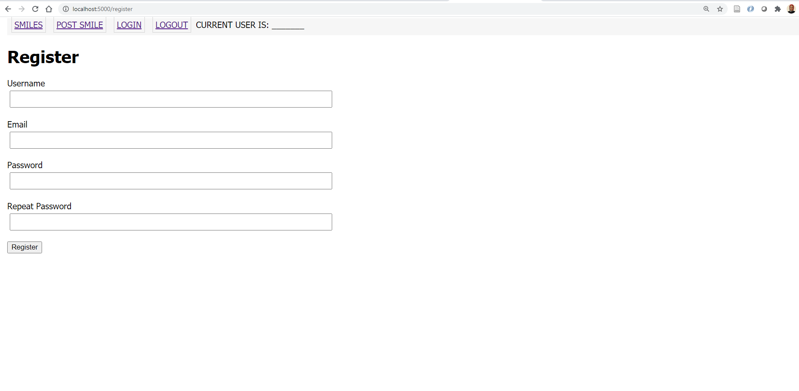
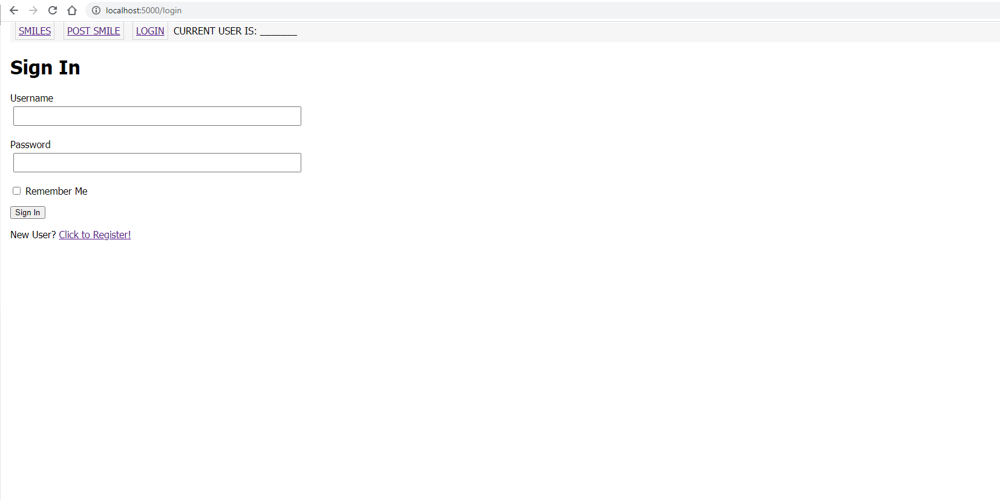
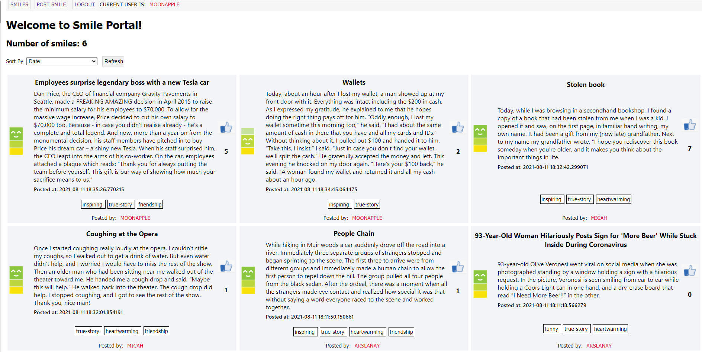
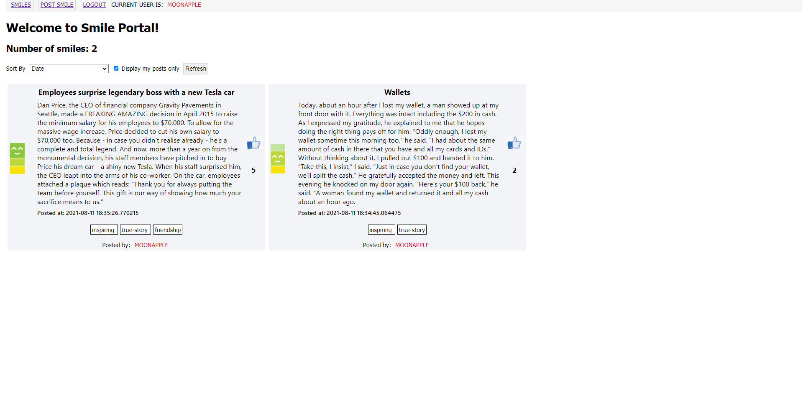
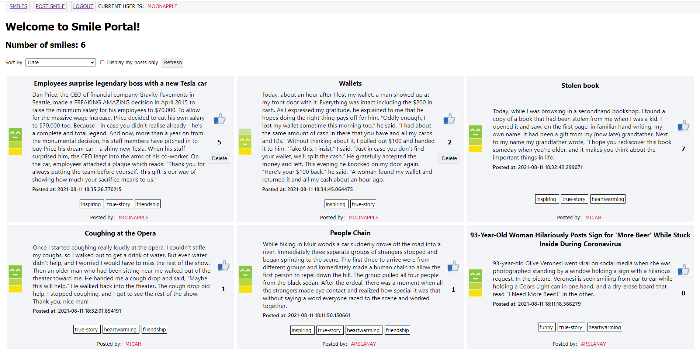
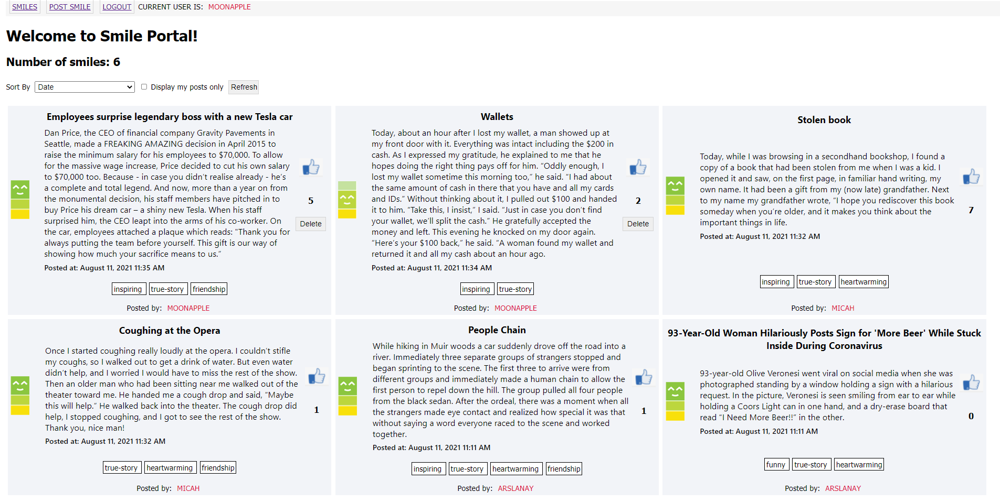

# Warmup Project - CptS322 - Fall 2021

# Milestone3

---

### Task 1: Get Started

---

In Milestone3,  you will start with your milestone-2 code and add additional features.

1. First, make sure that your are checked out to `milestone2` branch ; run the following comment if you are not already.

   ```
   git checkout milestone2
   ```


   Create and checkout to a new branch called "milestone3".  The following commands will create a new branch "milestone3" and checkout to that branch.

   ```
   git branch milestone3
   git checkout milestone3
   ```

   Make sure that your `milestone3` branch now has the latest milestone2 code. You will now be editing locally, and **remember to commit frequently**.


2. In milestone-3, you will have to make changes to the following files:

  * `main.css`
  * `base.html`
  * `index.html`
  * `register.html`
  * `login.html`
  * `auth_forms.py`
  * `models.py`
  * `auth_routes.py`

  The milestone-3 tasks will involve creating user profile, login, customizing view for the loged-in user, and deleting posts. We will include all registration/login/logout related routes and forms in `auth_routes.py` and `auth_forms.py` for better code organization and to improve code reuse. You can easily copy these files to your term project to add login/logout support. 

 --------

When you start milestone-3, the page should look like the following.

<kbd></kbd>

---

### Task 2:  Revise DB Model - Add `User` table

---
In the final version of our Smile app, only registered users will be able to view the smile posts and create new posts. We will store the registered "user" information in the `User` database model. 

1. In `models.py`, add a database model called `User`. The 'User' table will store the user's profile and login information. It should have the following attributes:

   |   | Field name | Description | Field type | Constraints | Comments |
   | :- | :-: | :-: | :-: | :-: | :-: |
   |  | id | auto generated id | integer | primary key | id of the User |
   |  | username | User's login username | string | max 64 chars, needs to be unique |  |
   |  | email | User's email address | string | max 120 chars, needs to be unique |  |
   |  | password_hash | User's login password | string | max 128 chars |  |

   * **Important note:**  Remember that, in order to re-create the database with the new schema, you need to first delete the current database file `smile.db` and re-run the backend app. The decorator function `initDB` in `smile.py` will re-create the database file before the first request to the app.   Alternatively, you may migrate the database to the modified structure using `flask-migrate`.

2. Define the following method attributes in `User` model. (See the `Student` model in StudentApp class exercise for examples.)

    * `__repr__` method : Prints user data. You should print the id and  username of each user.  See the `__repr__` methods in the class exercises.
    * `set_password`: Hashes a given password and sets it as the user's password. You should use Werkzeug `generate_password_hash` function to hash the password. 
    * `get_password` Verifies whether a given password matches the user's password.  You should use the Werkzeug `check_password_hash` function.

  - Make sure to import `generate_password_hash` and `check_password_hash` functions from `werkzeug.security` package. 
  
---

### Task 3: Register User

---

1. In `auth_forms.py`, add a new form class named `RegistrationForm`. We will use `RegistrationForm` to get the user's profile information.     

    * `RegistrationForm` should have the following attributes:

         * *username* : `StringField`, should not be empty, the username should not already exist in the `User` table. 
         * *email*: `StringField`, should not be empty, should have valid email syntax,  the email should not already exist in the `User` table. 
         * *two password fields*: `PasswordField`, both should not be empty, the password entered in both password fields should match.
         * *submit*:  `SubmitField` with label "Register".

    * Make sure to define all necessary form validators to enforce the constraints mentioned above. 
    * Don't forget to import `User` model in `forms.py`. You should also import `PasswordField` from `wtforms`.
    * In order to use the WTForms `Email()` validator, you need to install `email-validator` extension. 
    
      ```pip install email-validator```    

2. In `register.html`, add a form template to render an instance of a `RegistrationForm`. (You will create the form instance in step-3 and pass it to `render_template`  when `register.html` is rendered. ) 
   
    * The form should display all form elements. When the user input is not valid, it should display the error messages from the validators. See the StudentApp `register.html` page for an example.  
   
3. In  `main.css`, define a CSS styling class element called `forminput` to style the form input fields. Specify appropriate width, margin, padding, and fort syling for the form inputs. Make sure to specify the with as a percentage. 

4. In `auth_routes.py` add a new route to the `bp_auth` Blueprint for registering users.   

        * URL : `/register`
        * Methods: 'GET' and 'POST'
    
    * The route decorator function should create a `RegistrationForm` instance and pass it to the `register.html` template for rendering. 

    * When the form is submitted it should create a new user and add it to  the database. It should then issue an appropriate flash message redirect to `routes.index`. (**Note:** In task 4, we will change this and redirect to `auth.login`. )

    * Don't forget to import `RegistrationForm` from `app.Controller.auth_forms`  and `User` from `app.Model.models` in `auth_routes.py`.  

5. Go to the page `http://localhost:5000/register`, fill out the form, and submit.  

      * See the below image for an example styling of the registration form. 

      <kbd>  </kbd>

6. Make sure that the user is successfully registered by running SQLAlchemy query statements in the Python command line. The below code should print all registered users.  

    ```python
      > python 
      >>> from app import create_app, db
      >>> app = create_app()
      >>> app.app_context().push()
      >>> from app.Model.models import User
      >>> allUsers = User.query.all()
      >>> for u in allUsers:
      >>>     print(u)
      ```
      
---

### Task 4: Login and Logout

---

In Task 4, we will add simple login and logout functionality to our Smile app. Below is a brief checklist of the changes you need to implement. You should refer to the Student App class exercise to see how we implemented login/logout using `flask-login`.

 1. Install flask-login:
    ```
      pip install flask-login
    ```

 2. Make the following edits in `app\__init__.py`. 
      * Import `flask-login`
     
     ```python
       from flask_login import LoginManager
     ```

      *  Create `LoginManager` object and configure the login view as `auth.login`
     ```
       login = LoginManager()
       login.login_view = 'auth.login'
     ```
      * In `create_app` function, configure the app object for login by calling ```login.init_app(app)```. See StudentApp application for an example. 


 3. In `models.py`, include the following imports. 
    ```python
      from flask_login import UserMixin
      from app import login
    ```
    Also, have the `User` model inherit from flask-login's `UserMixin` class. 

 4. Each time the logged-in user navigates to a new page, Flask-Login retrieves the ID of the user from the session, and then loads that user into memory. Because flask-login knows nothing about databases, the application needs to configure a user loader function called to load a user given the ID. 

    Add the following to `models.py`
      ```python
        @login.user_loader
        def load_user(id):
            return User.query.get(int(id))
      ```

 5. In `auth_forms.py`, add a new form class named `LoginForm`. 

    * `Login` should have the following attributes:
        * username : `StringField`, should not be empty.
        * password: `PasswordField`, should not be empty.
        * remember_me: `BooleanField`
        * submit:  `SubmitField` with label "Sign In".
    * Make sure to import `BooleanField` from `wtforms` in `auth_forms.py`
    
 6. In `login.html`, add template to render an instance of a `LoginForm`. (You will create the form instance in step-3 and pass it to `render_template` function when `login.html` is rendered. ) 
   
    * The form should display all form elements. When the user input is not valid, it should display the error messages from the validators. 
    * Style the form elements. 
    * In `login.html`, include a link to the `auth.register` route underneath the form. 


 7. In `auth_routes.py` add the `login` and `logout` routes to `bp_auth` Blueprint. See the StudentApp class exercise for example route implementations. 

     * For `login`: 
       * If the user is already authenticated (logged-in), it should redirect to `routes.index`. If not,  it should create an instance of `loginForm` and pass it to the `login.html` template for rendering. 
       * When the form is submitted, if the username and password match the user's credentials, it should login the user by calling `login_user` function of flask-login and redirect to `routes.index`. Otherwise a `flash` message should be issued and the page should be redirected back to `auth.login`. 

     * For `logout`: 
       * it should logout the user by calling `logout_user` function of flask-login and redirect to `routes.index`. 

     * Don't forget to add the following import statements in `auth_routes.py`.  
       ```python
          from flask_login import current_user, login_user, logout_user, login_required
          from app.forms import LoginForm
       ```

 8. In `base.html`, add the URL links for `auth.login` and `auth.logout` . When the user is logged-in, the "Logout" link should be displayed, otherwise the "Login" link should be displayed. You need to include a conditional statement in your template to accomplish this. 

 9. In our app, we would like only the logged in users to see the smile posts. Therefore, all the routes, except `register` and `login`, should be protected from unauthorized users. 
    * Add the `@login_required` decorator to all routes in `routes.py` and `logout` route in `auth_routes.py` (i.e., all routes except `register` and `login`).
    * Make sure to import `current_user` and `login_required` from `flask_login` in `routes.py`. 

    * When you open the login page on the browser (i.e., `http://localhost:5000/login`, the page will look like the following:
    
    <kbd>  </kbd>

 10. In `base.html` display the username of the current user in the navigation bar. Username should be displayed only when the user is authenticated. 

 11. In `auth_routes.py`, in the `register` and `login` routes, check whether the current user is already authenticated. If so, the app should redirect to the index page (i.e., `routes.index`). 

---

### Task 5: Associate Posts with Users

---
In our app, we would like to keep track of which posts are posted by which users. To accomplish this, we need to associate the users with the posts they created. 

 1. In `models.py`, add a new integer column named `user_id` to the `Post` model. `user_id` should be a foreign key column referencing to the user's id (i.e., `user.id`).  See the `Class.major` column in StudentApp class exercise for an example.

 2. In `models.py`, add a new "many-to-one" relationship attribute named `posts` to the `User` model. The relationship should refer to the `Post` table and have a `backref` value "`writer`".  The `User.posts` relationship retrieves the posts for a given user and `writer` refers to the user for a given post.  See the `Major.classes` relationship in StudentApp class exercise for an example.

 3. Define a method called `get_user_posts` in the `User` class that returns the posts for the user (i.e., returns `self.posts` relationship) . Remember that all methods of a class should have `self` as their first argument.
   
    * Note that in order to re-create the database with the new schema, you need to first delete the current database file `smile.db` and re-run the backend app.
  
 4. In `routes.py`, revise the `postsmile` route function. When you create a new post, initialize `user_id` with the `current_user`'s id. 

 5. Open the app, create a user account, login, and create couple posts. You can test whether these new posts are successfully associated with the logged in user by running some SQLAlchemy statements on the command line:

  ```python
      > python 
      >>> from app import create_app, db
      >>> app = create_app()
      >>> app.app_context().push()
      >>> from app.Model.models import Post,User
      >>> user1 = User.query.filter_by(id = 1).first()
      >>> post1 = Post.query.filter_by(id = 1).first()
      >>> # the following will print the posts of the user
      >>> for p in user1.posts:
      >>>     print(p)
      >>> # the following will retrieve the user who created the post    
      >>> post1.writer
      >>> # the following will print the username of the user who created the post  
      >>> print(post1.writer.username) 
  ```

 6. In `_post.html`, display the username of the user who created the post. 

   * Use the SQL alchemy command from Task 5.4 to get the username of  the post's writer. 
   * Enclose the `username` in a `<span>` element and apply appropriate CSS styling (for example you can apply  `useritem` CSS class selector). 
     <br><br>
   
------

When you open the index page on the browser (i.e., `http://localhost:5000`), the page will look like the following:


<kbd>  </kbd>
---

### Task 6: Displaying Current User's Posts

---

Now, we will add an option to our app for displaying current user's posts only. We will add a checkbox to the sort form; when checkbox is selected, only current user's posts will be displayed. Otherwise, all posts from all users will be displayed. 

1. In `forms.py`, add a new `BooleanField` field to `SortForm` (i.e., a checkbox). Apply an appropriate label for the `BooleanField` (for example, "Display my posts only.")
2. In `index.html`, edit the sort form template and add the new checkbox field and it's label. (i.e., `BooleanField`)
2. In `routes.py`, edit the `index` route decorator function. When the sort form is submitted, before you sort the posts, you should check the checkbox field data:  
    * if the checkbox is clicked (i.e, if the data of the `BooleanField` is `True`) you should filter by the results and return only current user's posts (Hint: `current_user.get_user_posts()` will return all the posts of the logged-in user. You need to apply `order_by` to further sort them.)
    * otherwise, you should get all posts in the Post table.  

   When you open the main page on the browser (i.e., `http://localhost:5000/`) and select the "Display my posts only!" checkbox,  the page will be similar to the following:.

  <kbd>  </kbd>

---

### Task 7: Deleting Posts

---

In our app, the logged-in user will be able to delete their own posts. 

 1. In `routes.py` add a new route for deleting users. Because the delete action causes changes in the application date, we will implement it as a 'POST' request.  

  * URL : `/delete/<post_id>`
  * Methods: 'DELETE' and 'POST'
    

    1. The route decorator function should query the `Post` table and get the post with `id=post_id`. (Remember that `post_id` needs to be passed to the decorator function as argument) 
    2. If the post is found, it should remove all the tags for that post. 
        * (**Hint**: in a `for` loop iterate over all tags of the post and remove them:
            * `thepost.tags.remove(t)` where `thepost` is the post that will be deleted and `t` is a tag in `thepost.tags`) 
        * You should commit after you remove the tags of the post. You will get a SQLAlchemy error if you fail to commit. 
    3. Delete the post and commit. (Hint: `db.session.delete(thepost)`)
    4. You can issue flash messages when the post is succesfully deleted. 
    5. After the post is deleted, the page should be redirected to `routes.index`'.

 2. Add a delete button to the users posts. In `_post.html`, add an HTML form element below the "number of likes". The template of the form is given below. Set the `action` of this form  (i.e., `###`) to the URL of the `routes.delete` route. (Hint: use `url_for`)
    ```html
    <form action="###" method="post">
      <input type="submit" value="Delete" >
    </form>
    ```
     For simplicity, here we issue the `delete` POST request in a basic HTML form element. You may alternatively create a simple wt-form element in the `routes.index` route and render it here. (Similar to the `EmptyForm`  in the Student App class example). 
  

     To style the "Delete" button, you can apply the `button` CSS selector for the submit input element. 

 3. You should display the "Delete" button **only for the posts of the current user**, i.e., when the post's writer (`post.writer`) is the current user. Other posts should not display the "Delete" button. 


    When you complete Task-7, the index page will look like the following: 

  <kbd>  </kbd>

---

### Task 8: Formatting timestamps

---

Lastly, we will format the UTC timestamps using `flask-moment`. See the Student App class exercise for an example. 

 1. Install `flask-moment`.
    ```
      pip install flask-moment
    ```
 2. Make the following edits in `app\__init__.py`. 
   * Import `flask-moment`
      ```python
        from flask_moment import Moment
      ```

   *  Create `Moment` object.  
      ```python
        moment = Moment()
      ```
   * In `create_app` function, configure the app object for `Moment` by calling ```moment.init_app(app)```. 
      ```python
        moment.init_app(app)
      ```

 3. In `base.html`, include the following within the `<head>` element.  
      ```python
        {{ moment.include_moment() }}
      ```

 4. Style the post timestamps by applying the `moment` object's `format` function. For example:
    ```python
      moment(post.timestamp).format('LLL')
    ```

    Choose an appropriate timestamp format. See [https://blog.miguelgrinberg.com/post/the-flask-mega-tutorial-part-xii-dates-and-times](https://blog.miguelgrinberg.com/post/the-flask-mega-tutorial-part-xii-dates-and-times) for different format options. 

-----

When you complete milestone3 , the main page will be similar to the following:

<kbd>  </kbd>

---

### Run automated tests

---

Run the provided automated tests under `/tests` directory:
  * `test_models.py` includes unit tests for the model. These tests use the `unittest`  testing framework.
    To run them run the following command on the terminal. 
       * ```python -m unittest -v tests\test_models.py```

  * `test_routes.py` includes functional tests , testing the major routes of the app. These test use `pytest` framework.
    To run them run the following command on the terminal. 
       * ```pytest -v tests\test_routes.py```

In your term project, you will write test similar to these. 


---
### How to Submit
---
1. Commit and push to GitHub

   *  Make sure you are in branch `milestone3`, and check the commit status. 
       ```
       git checkout milestone3
       git status
       ```
   * Add and commit your changes locally. Make sure you are in branch `milestone3`. 
       ```
       git add <list all new and changed files here; seperate filenames with space.>   (or  git add .)
       git commit -am "Your own commit message"
       ```

   * Push the `milestone3` branch to your remote GitHub repo:
       ```
       git push origin milestone3
       ```
       - You can commit multiple times. Please make sure not to make any commits to `milestone3` branch after the milestone3 deadline. 
  

2. Submit your repo link on Canvas

   * Copy your repository URL and submit it in the Canvas `Milestone3` dropbox. 
 
